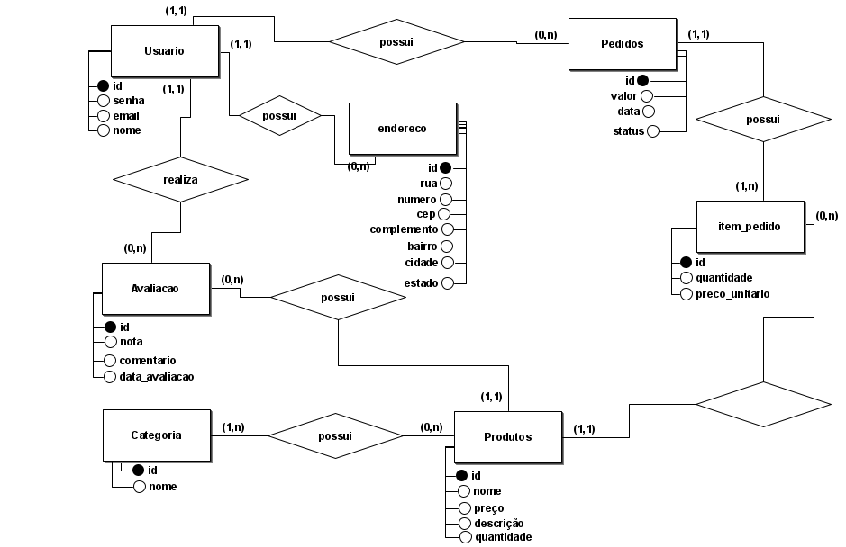
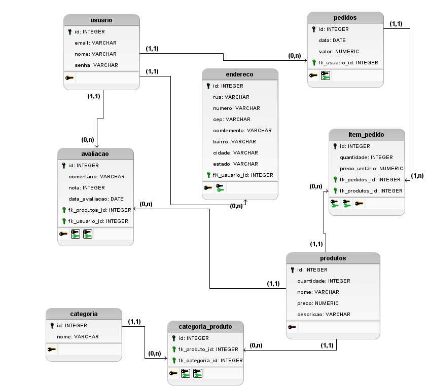

<h1 align="center">Projeto de Desenvolvimento de Aplicações Web 2 - Loja Virtual</h1>

Este repositório contém a modelagem de banco de dados para uma loja virtual, desenvolvida como parte do projeto da
disciplina de Desenvolvimento de Aplicações Web 2.

## Documentação

- [Minimundo](docs/Mini%20mundo%20-%20Loja%20Virtual.md) - Descrição do domínio do problema

## Esquemas

O projeto inclui:

- **Esquema Conceitual**
  
- **Esquema Lógico**
  

## Como subir o container Docker do Banco de dados
````shell
docker-compose up -d
````
## Como parar o container
docker-compose down